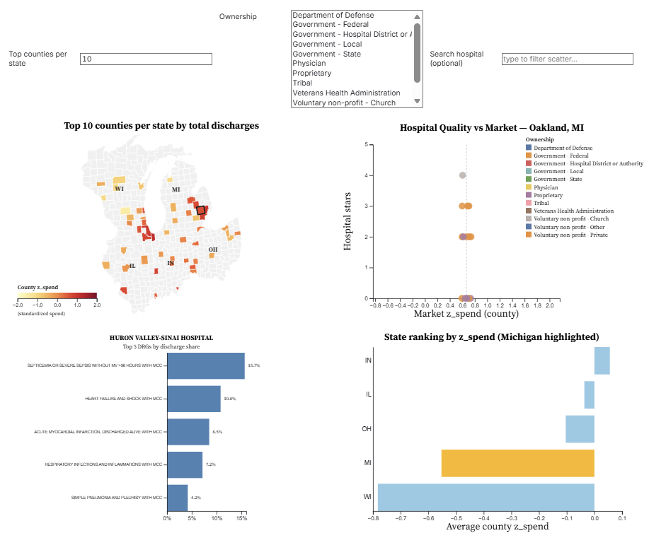

# Exploring Medicare Hospital Spending and Quality in the Upper Midwest
**Interactive Visualization Dashboard (Observable + D3.js)**

Live dashboard (Observable):
https://observablehq.com/d/8428ef9bfbf826d9

## Overview
This project explores how **Medicare inpatient spending** relates to **hospital quality** across a five-state Upper Midwest region:
**Michigan, Ohio, Indiana, Illinois, and Wisconsin**.

The dashboard is designed for a **regional health-insurance or consulting analyst** who needs to:
- identify the largest inpatient markets (counties) and whether they are relatively high/low spend after standardization,
- compare hospital quality (CMS star ratings) within those markets,
- drill into clinical volume drivers (MS-DRGs) for a hospital,
- benchmark states against each other on standardized spending.

## What’s in this repo

### Data (cleaned outputs used by the dashboard)
These files are produced by the preprocessing pipeline and used directly in Observable:
- `cleaned_data/counties_2023.csv` — county-level spend, quality, and capacity
- `cleaned_data/hospitals_2025.csv` — hospital attributes + county FIPS
- `cleaned_data/hospital_drg_top5.csv` — top 5 DRGs by discharge share for each hospital
- `cleaned_data/counties_geo_region.json` — GeoJSON boundaries for the five-state region

### Code (reproducible preprocessing)
- `Data Processing.ipynb`

The pipeline uses Python (`pandas`, `geopandas`) and includes:
- cleaning county names and joining to county shapefiles to assign 5-digit FIPS codes,
- computing county standardized spend (`z_spend`) and bed-weighted county quality,
- aggregating MS-DRG discharges (top-5 shares) and computing DRG concentration metrics (HHI).

## Dashboard design (4 linked views)
Implemented in Observable (D3.js + Inputs) as four coordinated panels:
1. **Choropleth map**: top counties by discharges; color encodes `z_spend`
2. **Hospital scatterplot**: hospital star rating vs market spend; size = beds; color = ownership
3. **Top-5 DRG bar chart**: hospital case-mix drilldown (DRG discharge share)
4. **State ranking bar chart**: average county `z_spend` across the five states

## Data sources
Public U.S. datasets:
- CMS Medicare Geographic Variation (county-level standardized spending)
- CMS Hospital General Information (hospital attributes + overall star rating)
- CMS Medicare Inpatient Hospitals by Provider and Service (MS-DRG discharges/payments)
- U.S. Census county shapefile (county boundaries)

## How to reproduce
1. Open and run `Data Processing.ipynb` (Python).
2. Outputs will be same as in `cleaned_data/`.
3. In Observable, either upload the processed files or load them from GitHub Raw URLs.
